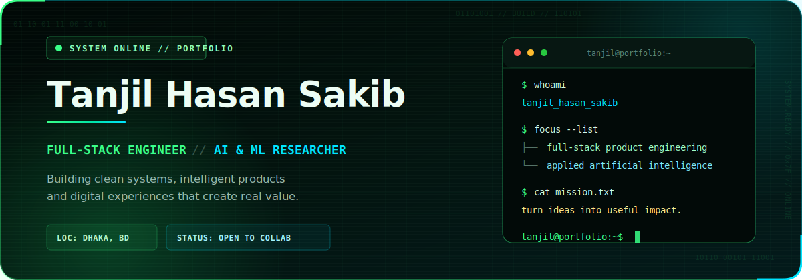

<p align="center">
  
</p>

<p align="center">
  <a href="mailto:98sakib@gmail.com"></a>&nbsp;
  <a href="https://www.linkedin.com/in/tanjil-sakib/"></a>&nbsp;
  <a href="https://about.me/tanjilSakib"></a>&nbsp;
  <a href="https://orcid.org/0009-0000-9874-868X"></a>
</p>

## Hello — I'm Tanjil 👋

I am a **full-stack engineer and AI/ML researcher** based in Dhaka, Bangladesh. I enjoy taking a product from a rough idea to a dependable application—designing the interface, building the API, modeling the data and refining the user experience.

```text
CURRENT FOCUS  →  Full-stack product engineering · Applied AI · Cloud deployment
WORKING WITH   →  ASP.NET · Next.js · NestJS · Node.js · PostgreSQL · MongoDB
OPEN TO        →  Software engineering · Research · Meaningful collaborations
```

## Selected Projects

<table>
  <tr>
    <td width="50%" valign="top">
      <h3>📈 Richie Rich Leads</h3>
      <p>A production-oriented lead submission and management dashboard with secure admin access, duplicate detection, flexible filtering, CSV export and MongoDB-backed storage.</p>
      <p>
        
        
        
      </p>
      <a href="https://github.com/tanjil98/richie-rich-leads"><strong>Explore repository →</strong></a>
    </td>
    <td width="50%" valign="top">
      <h3>🍽️ Local Food Lovers Network</h3>
      <p>A full-stack community platform where users discover local food, publish and manage reviews, rate dishes and save favorites using protected routes and Firebase authentication.</p>
      <p>
        
        
        
      </p>
      <a href="https://food-lover-d4878.web.app"><strong>Live demo ↗</strong></a> · <a href="https://github.com/tanjil98/Local-Food-Lovers-Network-main"><strong>Source →</strong></a>
    </td>
  </tr>
  <tr>
    <td width="50%" valign="top">
      <h3>🛒 E-commerce Management System</h3>
      <p>A full-stack administration system for managing business information and manager accounts, built with a typed NestJS/Next.js architecture, PostgreSQL and JWT authentication.</p>
      <p>
        
        
        
      </p>
      <a href="https://github.com/tanjil98/Advanced-Web-Tech-Full-Stack-Nest-Next--main"><strong>Explore repository →</strong></a>
    </td>
    <td width="50%" valign="top">
      <h3>🚌 P-Ticket Booking</h3>
      <p>A responsive online bus-ticket experience with visual seat selection, real-time price calculation, coupon rules, validation and a clear booking confirmation flow.</p>
      <p>
        
        
        
      </p>
      <a href="https://github.com/tanjil98/Online-Booking-System"><strong>Explore repository →</strong></a>
    </td>
  </tr>
</table>

<p align="right"><a href="https://github.com/tanjil98?tab=repositories"><strong>View all repositories →</strong></a></p>

## Engineering Toolkit

| Area | Technologies |
|---|---|
| **Frontend** | React, Next.js, JavaScript, TypeScript, Tailwind CSS |
| **Backend** | Node.js, Express, NestJS, ASP.NET Core, REST APIs |
| **Data** | PostgreSQL, MongoDB, MySQL |
| **AI & Vision** | Python, TensorFlow, OpenCV, applied deep learning |
| **Workflow** | Git, GitHub, Docker, Firebase, Vercel, Render |

<p align="center">
  
</p>

## Research Notes

- **Small Language Models:** architectures, techniques, evaluation, problems and future adaptation — [arXiv](https://doi.org/10.48550/arXiv.2505.19529)
- **Real-Time Confidence Detection through Facial & Hand Gestures** — accepted at MECON 2025 — [arXiv](https://doi.org/10.48550/arXiv.2506.09153)
- My broader research identity and publication record are available through [ORCID](https://orcid.org/0009-0000-9874-868X).

---

<p align="center">
  <strong>Good software should feel simple—even when the engineering behind it is not.</strong><br/><br/>
  <a href="mailto:98sakib@gmail.com">Start a conversation</a>
  &nbsp;·&nbsp;
  <a href="https://github.com/tanjil98?tab=repositories">Explore my work</a>
</p>
